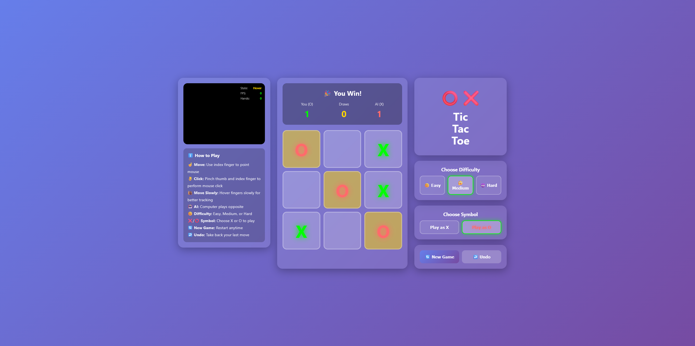

<div align="center">

# Hand Gesture Tic-Tac-Toe

**A real-time Tic-Tac-Toe game controlled entirely through hand gestures via your webcam**

[](https://python.org)
[](https://flask.palletsprojects.com)
[](https://developer.mozilla.org/en-US/docs/Web/JavaScript)
[](https://mediapipe.dev)
[](#license)

</div>

---

## Overview

Hand Gesture Tic-Tac-Toe replaces mouse and keyboard with your hand. Using MediaPipe for real-time hand tracking through your webcam, you move the cursor with your index finger and click by pinching — all against an AI opponent powered by the Minimax algorithm with alpha-beta pruning.

---

## Features

- **Gesture Control** — Move cursor with your index finger, click by pinching thumb and index finger together
- **AI Opponent** — Three difficulty levels (Easy, Medium, Hard) backed by the Minimax algorithm
- **Symbol Choice** — Pick X or O before each game
- **Score Tracking** — Persistent win, loss, and draw counters across rounds
- **Undo Move** — Take back your last placed move
- **Responsive Design** — Adapts to various screen sizes

---

## Tech Stack

<div align="center">

[](https://python.org)
[](https://flask.palletsprojects.com)
[](https://developer.mozilla.org/en-US/docs/Web/HTML)
[](https://developer.mozilla.org/en-US/docs/Web/CSS)
[](https://developer.mozilla.org/en-US/docs/Web/JavaScript)

</div>

<br>

| Layer | Tools |
|---|---|
| **Backend** | Flask, Flask-SocketIO |
| **Frontend** | HTML5, CSS3, JavaScript |
| **Hand Tracking** | MediaPipe Hands |
| **AI** | Minimax algorithm with alpha-beta pruning |

---

## Project Structure

```
tic-tac-toe-hand-tracking/
├── app.py                      # Flask server setup and routing
├── requirements.txt            # Python dependencies
├── templates/
│   └── index.html              # Main HTML structure and layout
├── static/
│   ├── css/
│   │   └── styles.css          # All styling including responsive design
│   └── js/
│       ├── game.js             # Game logic, AI (minimax), win detection
│       ├── handTracking.js     # MediaPipe integration, gesture recognition
│       └── ui.js               # DOM manipulation, event handlers, display updates
└── images/
    ├── sc1.png
    └── sc2.png
```

---

## Getting Started

### Prerequisites

- Python 3.8+
- A working webcam
- A Chromium-based browser *(Chrome or Edge recommended)*

### Installation

1. **Clone the repository**
   ```bash
   git clone https://github.com/your-username/tic-tac-toe-hand-tracking.git
   cd tic-tac-toe-hand-tracking
   ```

2. **Install dependencies**
   ```bash
   pip install -r requirements.txt
   ```

3. **Run the application**
   ```bash
   python app.py
   ```

4. **Open in browser**

   Navigate to `http://localhost:5000` and grant camera permissions when prompted.

---

## How to Play

### Hand Gestures

| Gesture | Action |
|---|---|
| Point index finger | Move the cursor |
| Pinch thumb + index finger | Click / place your symbol |

### Game Controls

| Control | Description |
|---|---|
| **Difficulty** | Switch between Easy, Medium, or Hard before or after a game |
| **Symbol** | Choose X or O as your playing piece |
| **New Game** | Reset the board and start fresh |
| **Undo** | Take back your last move |

### Rules

- Get 3 of your symbols in a row — horizontal, vertical, or diagonal — to win
- The AI plays automatically after your move
- The board resets after a 2-second delay when the game concludes

---

## Screenshots

 

---

## Browser Compatibility

| Browser | Support |
|---|---|
| Chrome | Recommended |
| Edge | Full support |
| Firefox | Full support |
| Safari | Requires manual camera permission |

---

## Troubleshooting

**Camera not working?**
- Grant camera permissions when the browser prompts
- Ensure no other application is actively using the camera
- Refresh the page and try again

**Hand not detected?**
- Make sure you have adequate lighting
- Keep your hand fully within the camera frame
- Try adjusting your hand position or distance from the camera

---

## License

Open source — feel free to modify and use.